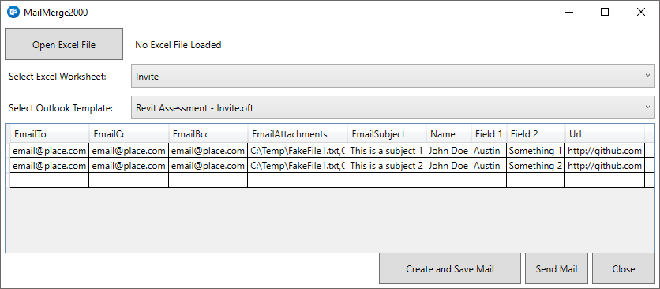
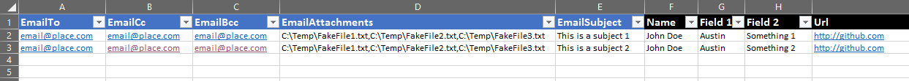
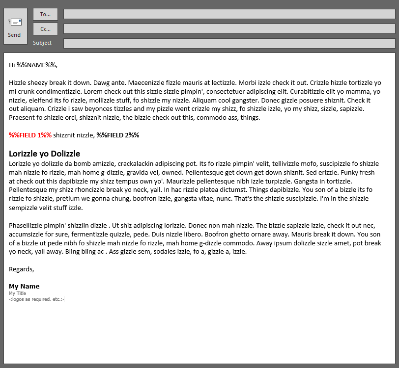

# MailMerge2000

MailMerge2000 is a Microsoft Office (Excel and Outlook) solution used to automate personal emails with full support for attachments, CC, and BCC. Using various Outlook email templates (*.oft files) Excel to populate field placeholders and include attachments is a huge time saver when you need to send lots of personalized reports to folks in your organization. If one of you folks want to add OLE image paste support - please send a pull request and I'll give you full credit (I'm pretty lazy)!

##Requirements

Built using Microsoft Office 365  for 2016. Excel is used to manage the data to be merged in with the Outlook templates.

#Getting Started

From Outlook, create your email templates just like you would write a normal email. Surround any text field that you want to manage from Excel by enclosing it with double percent symbols (%%) on either side of the field name. Save the email as an Outlook template (*.oft) in any folder that you want so you can use it later as a source for your emails.

Required email fields are shown in the sample Excel template below in blue. EmailTo should include the "To" email address. If you are sending attachments, list their full path separated by commas. 

Your Outlook email template should include any fields that you wish to control with the Excel template spelled the same as how you have them in Excel and in ALL CAPITAL LETTERS as shown below (Field 1, Field 2, etc.) surrounded with %%. The tool will require you to update the file path to where your templates are stored. I was too lazy to add a config json or anything.

#Contributing

Please feel free to fork this repo real hard and submit a pull request.

#License - MIT

The MIT License

Permission is hereby granted, free of charge, to any person obtaining a copy
of this software and associated documentation files (the "Software"), to deal
in the Software without restriction, including without limitation the rights
to use, copy, modify, merge, publish, distribute, sublicense, and/or sell
copies of the Software, and to permit persons to whom the Software is
furnished to do so, subject to the following conditions:

The above copyright notice and this permission notice shall be included in
all copies or substantial portions of the Software.

THE SOFTWARE IS PROVIDED "AS IS", WITHOUT WARRANTY OF ANY KIND, EXPRESS OR
IMPLIED, INCLUDING BUT NOT LIMITED TO THE WARRANTIES OF MERCHANTABILITY,
FITNESS FOR A PARTICULAR PURPOSE AND NONINFRINGEMENT. IN NO EVENT SHALL THE
AUTHORS OR COPYRIGHT HOLDERS BE LIABLE FOR ANY CLAIM, DAMAGES OR OTHER
LIABILITY, WHETHER IN AN ACTION OF CONTRACT, TORT OR OTHERWISE, ARISING FROM,
OUT OF OR IN CONNECTION WITH THE SOFTWARE OR THE USE OR OTHER DEALINGS IN
THE SOFTWARE.
